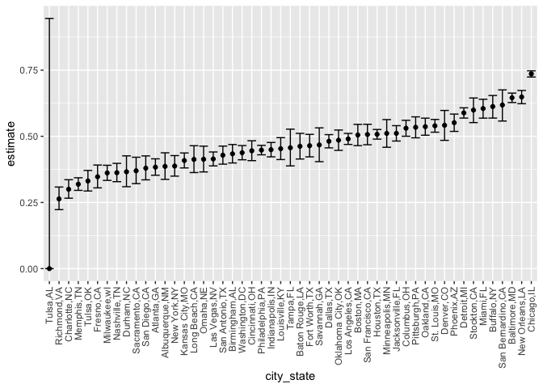
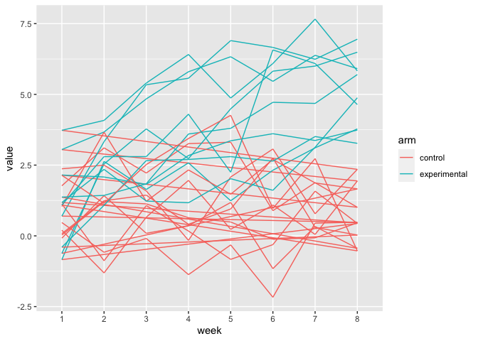
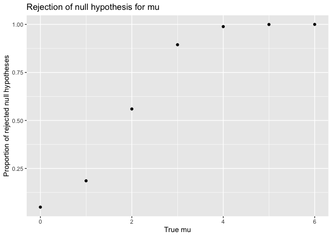
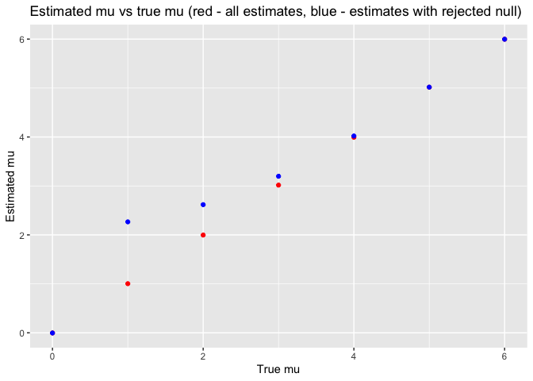

Homework 5
================
Anna Ostropolets
11/12/2020

# Problem 1

``` r
# loading the data
url <- getURL("https://raw.githubusercontent.com/washingtonpost/data-homicides/master/homicide-data.csv")
data <- read.csv(text = url)
```

## describing the raw data

The data contains 52179 observations of homicides, committed in 50
cities in 28 states. It has the names of the victims, their age as well
as their gender and the disposition of cases and location (latitute and
longitude).

``` r
# summarizing numebr of  homicides
aggregated_data<-
  data %>%
  mutate(
    city_state = str_c(city, state, sep = ","),
    status = case_when(
      disposition == "Closed without arrest" ~ "unsolved",
      disposition == "Open/No arrest" ~ "unsolved",
      disposition == "Closed by arrest" ~ "solved",
    ),
    victim_age = na_if(victim_age,'Unknown')
  ) %>%
  filter(city_state != "Tulsa_AL") %>%
  group_by(city_state) %>%
  summarize (total_cnt = n(),
             unsolved_cnt = sum(status == "unsolved")) 
```

## create a prop.test function to estimate proportion of homicides and use it for all cities avaliable

``` r
prop.test(
  aggregated_data %>% filter(city_state == "Baltimore,MD") %>% pull(unsolved_cnt), 
  aggregated_data %>% filter(city_state == "Baltimore,MD") %>% pull(total_cnt)) %>% 
  broom::tidy()
```

    ## # A tibble: 1 x 8
    ##   estimate statistic  p.value parameter conf.low conf.high method    alternative
    ##      <dbl>     <dbl>    <dbl>     <int>    <dbl>     <dbl> <chr>     <chr>      
    ## 1    0.646      239. 6.46e-54         1    0.628     0.663 1-sample… two.sided

``` r
results <- 
  aggregated_data%>%
  mutate(
    prop_tests = map2(.x = unsolved_cnt, .y = total_cnt, ~prop.test(x=.x, n= .y)), tidy_tests = map(.x = prop_tests, ~broom::tidy(.x))
  ) %>%
  select(-prop_tests) %>%
  unnest(tidy_tests) %>%
  select(city_state, estimate, conf.low, conf.high)
```

## plot estimates and CIs

``` r
results %>%
  mutate(city_state = fct_reorder(city_state, estimate)) %>%
  ggplot(aes(x = city_state, y = estimate)) +
  geom_point() +
  geom_errorbar(aes(ymin = conf.low, ymax = conf.high)) +
  theme(axis.text.x = element_text(angle = 90, vjust = 0.5, hjust = 1))
```

<!-- -->

# Problem 2

## creating dataframe with tidy data for study participants

``` r
study_data <- 
  tibble(
    path = list.files("./data")) %>% 
  mutate(path = str_c("./data/", path),
         data = map(.x = path, ~read_csv(.x))) %>% 
  unnest(data) %>% 
  mutate(id = str_extract(path, "\\d+"),
         subject_id = as.numeric(id),
         arm = str_extract(path, "con|exp")) %>% 
  relocate(id, arm, path,everything()) %>% 
  mutate(arm = recode(arm, con = "control", exp = "experimental")) %>% 
  pivot_longer(week_1:week_8,
               names_to = "week",
               names_prefix = "week_",
               values_to = "value") %>%
  select (subject_id, arm, week, value)
```

## Creating a spaghetti plot with observations on each subject over time.

``` r
study_data %>% 
  ggplot(aes(x = week, y = value, group = subject_id, color = arm)) +
  geom_path()
```

<!-- -->

On average, subjects in experimental group have higher values than in
the control group. There is also an increase in values over time in
experimental group while in the control group there are no significant
changes.

# Problem 3

``` r
# Generate 5000 datasets with n = 30, mu = 0, and sigma = 5 and extract their means and p-values:

set.seed(3)

sim_ft <- function(n = 30, mu, sigma = 5) {
  
  sim_data = tibble(
    x = rnorm(n = n, mean = mu, sd = sigma))
  sim_data %>% 
    summarize(mu_hat = mean(x),
              p_value = t.test(x) %>% 
  broom::tidy() %>% pull(p.value))
}

sim_results <-
  rerun(5000, sim_ft(mu = 0)) %>% 
  bind_rows()
```

``` r
# Repeat the above for μ={1,2,3,4,5,6}

sim_results_2 <- 
  tibble(new_mu = c(0:6)) %>% 
  mutate(
    output = map(.x = new_mu, ~rerun(5000, sim_ft(mu = .x))),
    estimate = map(output, bind_rows)) %>% 
  select(-output) %>% 
  unnest(estimate)
```

``` r
# A plot showing the proportion of times the null was rejected vs the true value of μ
sim_results_2 %>% 
group_by(new_mu) %>%
  summarize(
    total = n(),
    rejected = sum(as.numeric(p_value) < 0.05 & mu_hat!=new_mu)) %>% 
  ggplot(aes(x = new_mu, y = rejected/total)) +
  geom_point() +
    labs(title = "Rejection of null hypothesis for mu",
       x = "True mu",
       y = "Proportion of rejected null hypotheses")  
```

<!-- --> Increase in
estimate is associated with increase in power

``` r
# A plot showing the average estimate of μ̂ the true value of μ
df1 <- sim_results_2 %>% 
group_by(new_mu) %>%
  summarize(avg_estimate = mean(mu_hat))

df2 <- sim_results_2 %>% 
  group_by(new_mu) %>% 
  filter(as.numeric(p_value) < 0.05) %>% 
  summarize(avg_estimate = mean(mu_hat))

inner_join(df1, df2, by = "new_mu") %>%
  ggplot() +
  geom_point(aes(x=new_mu, y=avg_estimate.x), color = "red") +
  geom_point(aes(x=new_mu, y=avg_estimate.y), color = "blue") +
      labs(title = "Estimated mu vs true mu (red - all estimates, blue - estimates with rejected null)",
       x = "True mu",
       y = "Estimated mu")  
```

<!-- -->

We see that whenever power increases estimated mu deviates towards true
mu for the test with rejected null hypothesis, while for the tests with
low power true mu and estimated mu are different.
